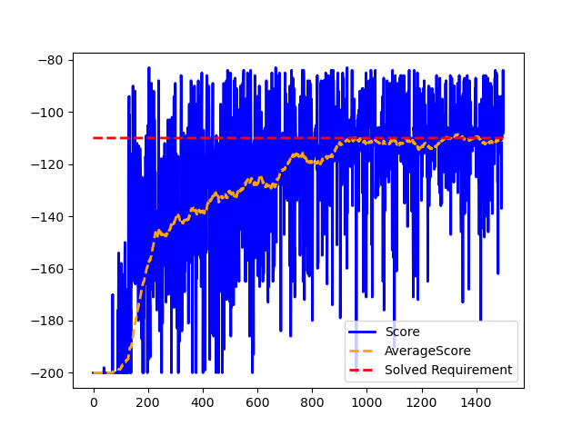
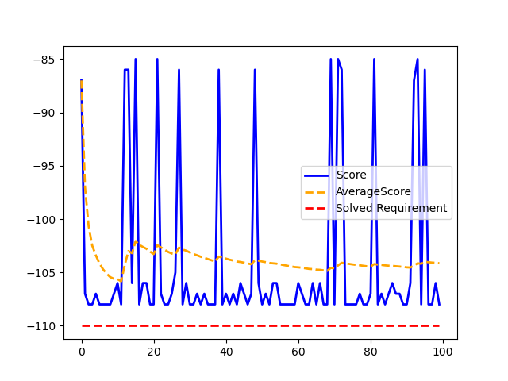
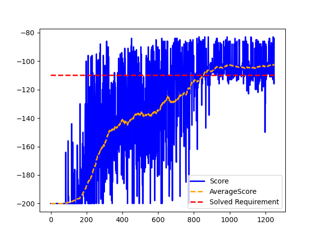
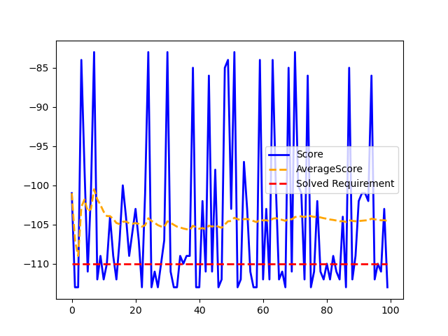
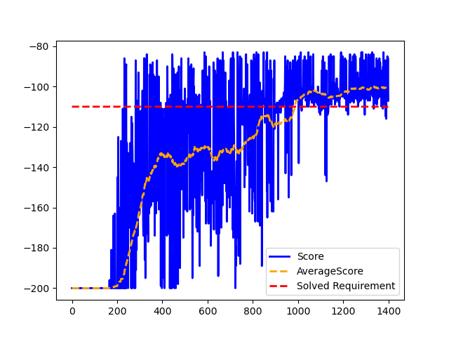

# OpenAI MountainCar-v0 DeepRL-based solutions
Using Deep Q-Network (DQN), Dueling DQN, and Dueling Double DQN (D3QN)  

Investigation under the development of the master thesis "DeepRL-based Motion Planning for Indoor Mobile Robot Navigation" @ Institute of Systems and Robotics - University of Coimbra (ISR-UC)  

# Software/Requirements
Module | Software/Hardware
------------- | -------------
Python IDE | Pycharm
Deep Learning library | Tensorflow + Keras
GPU | GeForce MX 250
Interpreter | Python 3.8
Python Environment | Anaconda
Packages | requirements.txt

**To setup Pycharm + Anaconda + GPU, consult the setup file [here](setup.txt)**.  
**To import the required packages, [requirements.txt](DQN/requirements.txt), type the following instruction in the project environment terminal:**  
> pip install -r requirements.txt

# :warning: **WARNING** :warning:  
The training generates a [.txt file](DQN/saved_networks.txt) that tracks the network models (in 'tf' and .h5 formats) that achieved the solved requirement of the environment. Additionally, an overview image (graph) of the training procedure is created.   
Keep in mind that to perform several training processes, the .txt, .png, and directory names must be change. Otherwise, information of previous trainings will get overwritten, and lost.  

Regarding testing, if you choose to load the .h5 model, a 5 episode training is done to initialize/build the keras.model network. Thus, the warnings above mentioned are also appliable to this situation.   
Loading the saved model in 'tf' is the recommended option. After finishing the testing, an overview image (graph) of the training procedure is also generated.  

# OpenAI MountainCar-v0
**Actions:** 
0 - Push car to the left    
1 - No action  
2 - Push car to the right

**States:** 
0 - Car position  
1 - Car velocity  

**Rewards:** 
Scalar value (-1) for every step taken

**Episode termination:** 
Car reaches position 0.5  
Episode length is greater than 200

**Solved Requirement:** 
Average reward of -110.0 over 100 consecutive trials

# Deep Q-Network (DQN)

  

<table>
<tr><th> Train </th><th> Test </th></tr>
<tr><td>

| Parameter | Value |
|--|--|
| Number of episodes | 1500 |
| Learning rate  | 0.001 |
| Discount Factor | 0.99 |
| Epsilon | 1.0 |
| Batch size | 64 |
| TargetNet update rate (steps) | 100 |
| Actions (MountainCar-v0 env) | 3 |
| States (MountainCar-v0 env) | 2 |

</td><td>

| Parameter | Value |
|--|--|
| Number of episodes | 100 |
| Epsilon | 0.01 |
| Actions (MountainCar-v0 env) | 3 |
| States (MountainCar-v0 env) | 2 |

</td></tr> </table>

  
  

  
  

> **Network model used for testing:** 'saved_networks/dqn_model20' ('tf' model, also available in .h5)  

# Dueling DQN

  

<table>
<tr><th> Train </th><th> Test </th></tr>
<tr><td>

| Parameter | Value |
|--|--|
| Number of episodes | 1250 |
| Learning rate  | 0.00075 |
| Discount Factor | 0.99 |
| Epsilon | 1.0 |
| Batch size | 64 |
| TargetNet update rate (steps) | 120 |
| Actions (MountainCar-v0 env) | 3 |
| States (MountainCar-v0 env) | 2 |

</td><td>

| Parameter | Value |
|--|--|
| Number of episodes | 100 |
| Epsilon | 0.01 |
| Actions (MountainCar-v0 env) | 3 |
| States (MountainCar-v0 env) | 2 |

</td></tr> </table>

  
  

  
  

> **Network model used for testing:** 'saved_networks/duelingdqn_model172' ('tf' model, also available in .h5)  

# Dueling Double DQN (D3QN)

  

<table>
<tr><th> Train </th><th> Test </th></tr>
<tr><td>

| Parameter | Value |
|--|--|
| Number of episodes | 1400 |
| Learning rate  | 0.001 |
| Discount Factor | 0.99 |
| Epsilon | 1.0 |
| Batch size | 64 |
| TargetNet update rate (steps) | 150 |
| Actions (MountainCar-v0 env) | 3 |
| States (MountainCar-v0 env) | 2 |

</td><td>

| Parameter | Value |
|--|--|
| Number of episodes | 100 |
| Epsilon | 0.01 |
| Actions (MountainCar-v0 env) | 3 |
| States (MountainCar-v0 env) | 2 |

</td></tr> </table>

  
  

  
  

> **Network model used for testing:** 'saved_networks/d3qn_model300' ('tf' model, also available in .h5)  
